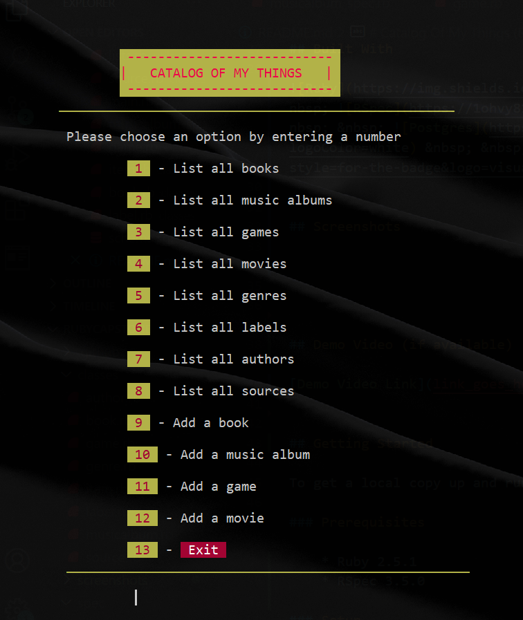
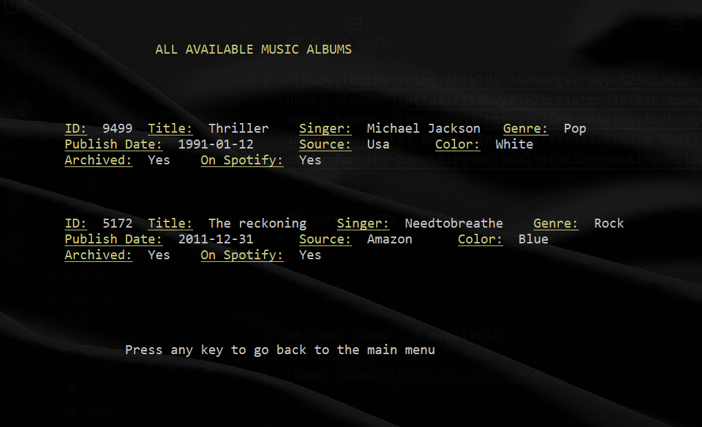
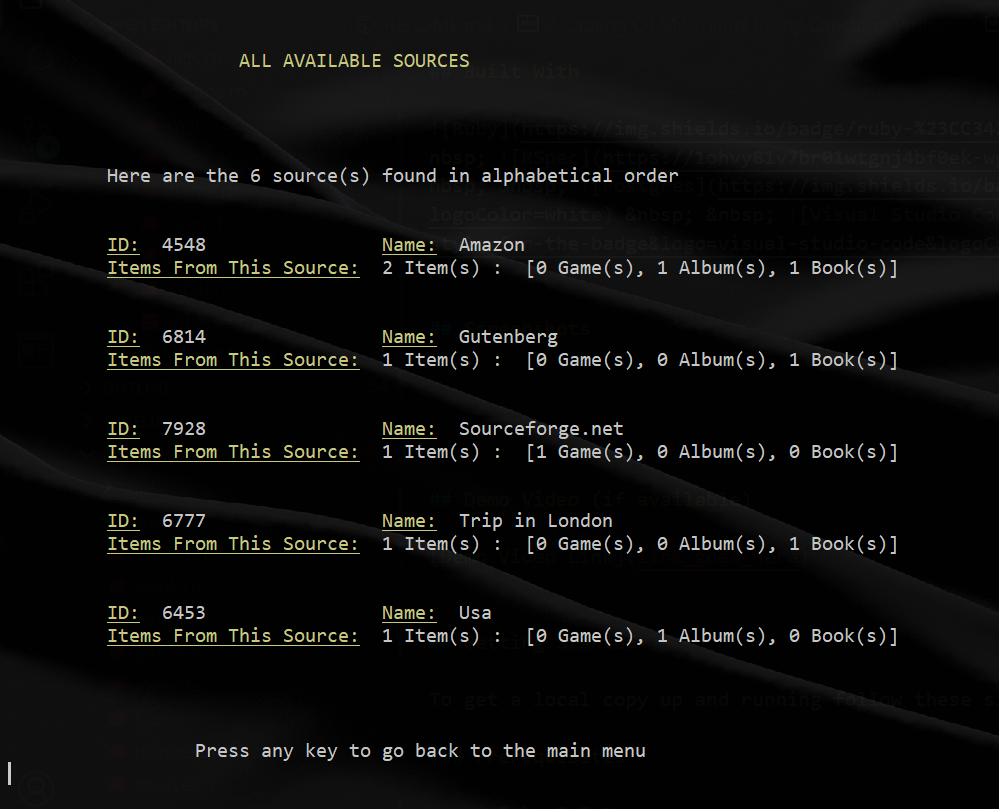
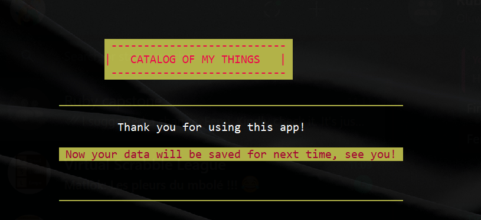

# Catalog Of My Things (Ruby Capstone Project)

## Introduction

### About the project

> In this **group project**, we created a **console app** that helps the users keep a record of different types of things they won: books, music albums, movies, and games. Everything is based on the UML class diagram presented below. The data is stored in JSON files but we will also prepared a database with tables structure analogical to the app's class structure.

### Diagram

### User Stories

 As a user:

   * I can list my items (books, music albums, movies, and games)
   * I can add new items to my catalog (books, music albums, movies, and games)
   * I can checks all the labels, genres, authors and sources of my items
   * I can exit the program from the menu
   * I can see the data I previously saved every time I run the app
   * [BONUS] I have a nice UI with colors in the console.

## Built With

 &nbsp; &nbsp;  &nbsp; &nbsp;  &nbsp; &nbsp; 

## Screenshots

 &nbsp; &nbsp; 

 &nbsp; &nbsp; 

## Demo Video

[Demo Video Link](https://drive.google.com/file/d/15nVoYKsxtMaHj99W5Z1l7_Egd49RJ5nR/view?usp=sharing)

## Getting Started

To get a local copy up and running follow these simple example steps.

### Prerequisites

    * Ruby 2.5.1
    * RSpec 3.5.0

### Setup

    1. In your terminal, `cd` to the directory where you want to copy this project.
    2. Still in your terminal, type `git clone git@github.com:Timowest12/rubycapstone.git`
    3. Run `cd rubycapstone`

### Install

    * After completing the setup section, type `bundle install`

### Usage

    * When all the gems are installed, type `ruby main.rb` to run the app.

### Run tests

    * Type `rspec` to run the tests.

## Authors

👤 **Timo Wester**

- GitHub: [@Timowest12](https://github.com/Timowest12)
- LinkedIn: [LinkedIn](https://www.linkedin.com/in/timo-wester/)
- AngelList: [timo-wester](https://angel.co/u/timo-wester)

👤 **King Josaphat Chewa**

- GitHub: [@Kingjosh007](https://github.com/Kingjosh007)
- Twitter: [@KingJoChewa](https://twitter.com/KingJoChewa)
- LinkedIn: [LinkedIn](https://www.linkedin.com/in/king-josaphat-chewa/)
- AngelList: [Kingjosh007](https://angel.co/u/Kingjosh007)

👤 **Oluwafemi Awoyemi**

- GitHub: [@phelian23](https://github.com/phelian23)
- Twitter: [@femikola23](https://twitter.com/femikola23)
- LinkedIn: [LinkedIn](https://www.linkedin.com/in/oluwafemi-awoyemi/)
- AngelList: [oluwafemi-awoyemi](https://angel.co/u/oluwafemi-awoyemi)

## 🤝 Contributing

Contributions, issues, and feature requests are welcome!

Feel free to check the [issues page](../../issues/).

## Show your support

Give a ⭐️ if you like this project!

## Acknowledgments

- Heartfelt thanks to Microverse

## 📝 License

This project is [MIT](./MIT.md) licensed.
